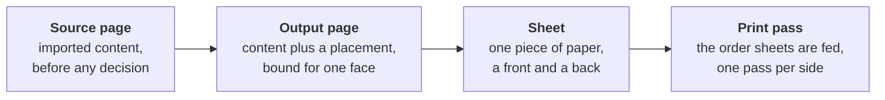
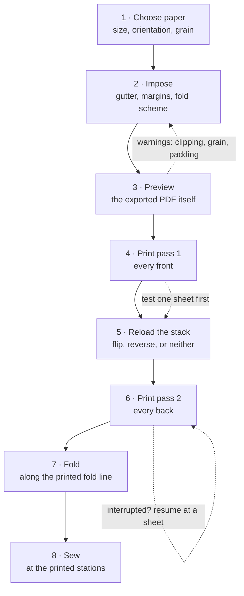

# Deckle

[](LICENSE)
[](pyproject.toml)
[](#installing)
[](#project-status)

A *deckle* is the rough, feathered edge left on a sheet of handmade paper by
the frame it was formed in — the mark of paper made one sheet at a time.
This is a tool for people who still make books that way.

Deckle imposes PDFs and folders of images for hand binding, and then prints
them on a printer that has no duplexer. It adds an alternating binding
**gutter**, shows you the exact physical sheets before you commit paper, and
drives the printer directly — splitting a double-sided job into two passes
with a reload instruction derived from your printer's own behaviour.

---

## Why this exists

Every imposition tool worth surveying produces a PDF and then abandons you at
the print dialog. [Bookbinder JS](https://github.com/momijizukamori/bookbinder-js)
is the closest peer and does the imposition well; it still ends at a download.
[pdfimpose](https://pdfimpose.readthedocs.io/) is a command that writes a file.
None of them can talk to a printer, which means none of them can know what
your printer does to a stack of paper on the second pass — and on a
manual-duplex job, that is the only thing standing between you and sixty
sheets printed upside down.

Bookbinder JS's own interface concedes the gap it cannot close: *"Remember!
Printer skew is a real thing!"* It can warn you. It cannot measure your
printer.

Deckle owns the print path. That is the whole argument for it, and everything
distinctive follows from it:

- **It drives the printer.** Two passes, an explicit reload instruction, a
  test-one-sheet option, and resume at *sheet* granularity when a run is
  interrupted. Resume refuses outright if the document changed underneath the
  saved session, because backs printed onto the wrong fronts is a ruined pile
  of expensive paper.
- **The preview rasterises the real exported PDF.** Not a redrawing of the
  layout — the artifact itself. Two implementations of imposition can share a
  bug and cheerfully agree with each other; a rasterised PDF cannot lie about
  what will print.
- **It knows about paper grain.** No other imposition tool surveyed models it,
  though the bookbinding literature calls grain the most consequential
  property paper has. Tell Deckle which way the fibres run and it warns you
  when a fold is going to fight them.
- **It writes a binding schedule.** A printable work order for the bench:
  what to gather, which sheet goes outermost, which pages land on each face,
  where the blanks fall, where to pierce for sewing, and how thick the spine
  will end up.

---

## The four-level page model

Deckle's whole vocabulary. Most tools conflate these levels, which is exactly
why they cannot express a request as ordinary as *"reprint sheet 7."*



| Level | What it is |
|---|---|
| **Source page** | A page of your PDF, or one image from a folder. Nothing has been decided about it yet. |
| **Output page** | That page with a placement transform, assigned to one face of one sheet. Or a blank filler, where the arithmetic needs one. |
| **Sheet** | One physical piece of paper, with a **front** and a **back**. Under flat sheets its front carries a **recto** (a right-hand page) and its back a **verso**; under folio each face carries one of each. |
| **Print pass** | The order sheets are *fed* for manual duplex. Pass 1 is every front; pass 2 is every back, in whatever order your printer's reload behaviour demands. |

---

## How a book actually gets made

This is the real sequence, at the bench, in order. Deckle covers steps 1–6.



Steps 4–6 are the part no other tool does. What happens between them is not a
formality: whether you reverse the stack, and which edge you flip each sheet
on, depends on where your printer ejects paper and which way round. Deckle
carries a **printer profile** describing that behaviour and derives the reload
instruction from it, in plain words, before you touch the stack.

<details>
<summary><b>Why the reload is the hard part</b></summary>

Two independent facts about your printer decide what pass 2 must look like:

| Printer behaviour | Consequence for pass 2 |
|---|---|
| Ejects **face down**, so the stack comes out reversed | Feed the backs **as printed** — the reversal already happened |
| Ejects **face up**, so the stack keeps its order | Feed the backs **reversed** |
| You flip each sheet on its **long** edge | Back sides need a 180° rotation |
| You flip each sheet on its **short** edge | No rotation |

Get any of these wrong and every back lands on the wrong front, or upside
down, and you find out after the whole run. Deckle decides it from the profile
and tells you what to do in a sentence.

</details>

---

## Two ways to make a book

Deckle offers exactly two impositions, and they differ in one physical fact:
whether the paper gets folded.

### Flat sheets — the proven path

One book page per sheet face. The **gutter** — the spine margin — alternates
sides so that when the leaves are stacked and bound along one edge, every
gutter lands at the spine. Nothing is folded and nothing is cut. Guillotine
and glue, or punch and post-bind, or sew through the side.

|  | Recto (front) | Verso (back) |
|---|---|---|
| Gutter sits at the | left edge | right edge |
| Fore-edge sits at the | right edge | left edge |
| Head / tail | top / bottom | top / bottom |

This is the path everything is verified against. Its placement output is
proven identical to the pre-refactor implementation across six setting
combinations and two documents, one of them a 300-page book with mixed page
sizes.

### Signatures — folio, saddle stitch (**experimental**)

Two book pages per sheet face, four per sheet, nested into folded gatherings
and sewn through the fold. Deckle draws the **fold line**, the **sewing
station** marks and a staircase **signature-order** bar on the spine, so a
miscollated stack is visible before a single stitch goes in.

It is implemented, unit-tested, and proven to emit two independent placements
per face with no scale drift between them. The fold is proven to sit at the
centre of the sheet on *both* faces — a sheet whose front hinges at the fold
and whose back hinges at the trimmed edges makes a book that will not open,
and nothing else would complain, because the PDF is valid either way.

**It is nevertheless marked experimental, for one specific reason.** The page
*ordering* — which source page lands in which cell of which sheet so the stack
reads correctly once folded — is hand-written arithmetic. Every automated test
proves that ordering is consistent and self-inverse. None of them proves it is
*the right* ordering, because software cannot tell you which way the paper
folds. The only real check is folding a physical dummy and reading it, and
that has not been done.

So print folio onto scrap, fold it, read it, and only then commit a real book.

`deckle schedule` makes the check faster than folding. It prints the ordering
in plain page numbers. Here is the real output for a 16-page signature —
this is verified output, not an illustration:

```
  Gather in this order -- first listed is the OUTSIDE of the fold:
    sheet 0  (outermost)
        front:  16  1
        back:   2  15
    sheet 1  (position 2)
        front:  14  3
        back:   4  13
    sheet 2  (position 3)
        front:  12  5
        back:   6  11
    sheet 3  (position 4)
        front:  10  7
        back:   8  9
```

Every bookbinding manual prints that table. Comparing them takes a moment, and
it closes the question that the whole feature is waiting on.

---

## Installing

Deckle is not released yet — there is no installer and no published binary.
Run it from source.

```
git clone https://github.com/Caleb68864/Deckle
cd Deckle
python -m pip install -e .
```

Python 3.11 or newer. On Windows, `run.bat deps` does the same thing and
prefers a `.venv` if it finds one.

To run the test suite as well, install the `dev` extra instead — it adds
`pytest` and `hypothesis`, which a plain `pip install -e .` does not:

```
python -m pip install -e ".[dev]"
```

Without it, `python -m pytest -q` — the command
[Project status](#project-status) and `docs/CONTRIBUTING.md` both ask you to
run — is not installed, and two test modules fail to collect at all.

`run.bat package` builds standalone Windows executables — `deckle.exe` (the
GUI) and `deckle-cli.exe` (headless, Qt-free) — into `dist\deckle`. They are
**not code-signed**, so SmartScreen will warn on first run; that is a
deliberate choice, not an oversight. The build runs from a clean `.buildenv`
virtualenv and is gated on an audit of the produced artifact — see
[Licensing](#licensing) for why that gate exists.

Only Windows binaries have ever been built. PyInstaller cannot cross-compile,
so a Linux build needs a Linux machine, and nobody has run one. macOS is not
supported.

---

## A first run, in about a minute

```bash
# What am I dealing with? Page count, page sizes, and any warnings.
python -m deckle.cli info book.pdf

# Impose it flat with a 3/4-inch gutter and write the PDF.
python -m deckle.cli export book.pdf -o book-deckle.pdf --gutter 0.75in

# Or fold it into signatures. Two portrait pages sit side by side,
# so the sheet has to be turned landscape.
python -m deckle.cli export book.pdf -o booklet.pdf \
    --fold-scheme folio --landscape --gutter 0.5in

# Read the work order before cutting anything.
python -m deckle.cli schedule book.pdf --fold-scheme folio --landscape
```

Lengths accept `in`, `pt`, `mm` or `cm`, with or without a space. A bare
number means points.

For the desktop app — import, arrange, preview, print:

```
python -m deckle
```

On Windows, `.\run.bat` launches it. From a terminal the `.\` matters: cmd
does not search the current directory. Double-clicking from Explorer works
as-is.

Drop a PDF on the window to start. `Ctrl+O`, `Ctrl+S` and `Ctrl+P` do what
they do everywhere else; the rest of the menu bar is in the
[GUIDE](docs/GUIDE.md). **Help → About Deckle** and **Help → Open diagnostics
folder** are what a bug report is built from, and neither touches the network
— Deckle has no update check.

<!--
  SCREENSHOTS WANTED. None exist yet; no image is linked here on purpose,
  because a broken image on the front page is worse than none.
  When they exist, put them in docs/images/ and add them here:
    1. docs/images/preview-spread.png -- the main window with a document
       loaded, "Both" toggle on, showing the front/back spread side by side
       with the red imageable-area guide and the dashed blue content box
       both visible. This is the single most persuasive image available.
    2. docs/images/print-dialog.png -- the Print dialog mid-job, showing
       the reload instruction for pass 2 in plain words.
    3. docs/images/schedule.png -- a printed binding schedule sitting on a
       bench beside a folded signature. Photograph, not a screenshot.
-->

---

## What Deckle does

Organised the way the work happens.

### 1 · Choose your paper

- Presets — Letter, A4, Legal, and in the app also A3 and Tabloid — or any
  custom size as `WxH` with a unit
- **Orientation.** Folio wants landscape stock; two portrait book pages have
  to sit side by side. Deckle *warns* about portrait paper under folio rather
  than silently rotating it.
- **Grain.** `long`, `short`, or `unknown`. Paper fibres align during
  manufacture; paper creases cleanly *along* them and cracks *across* them.
  The rule every bookbinding text gives is that grain must run parallel to the
  spine. Set it and Deckle checks. Here is a real warning, verbatim:

  > `[grain_direction] sheet 0: the fold runs across the paper grain, not
  > along it. long-grain stock at 792x612pt has its fibres running
  > horizontally, while the spine runs vertically. Expect the fold to crack
  > rather than crease, and the finished book to resist opening flat. Turn the
  > sheet, or use short-grain stock.`

  This catches the commonest home-binding mistake there is. Office Letter and
  A4 are long grain; turn a sheet landscape to fold a booklet and the fold now
  runs across the fibres. The default is `unknown` and silent, because most
  people have not checked their stock and a warning nobody can act on is noise.
- **Caliper.** The thickness of one sheet, which is what lets Deckle predict
  fore-edge creep and spine thickness.

### 2 · Import and arrange

- PDFs and image folders, interleaved — tick **Add to the current document**
  and a second import extends the book instead of replacing it, so a scan and
  a typeset title page make one job. Natural filename ordering, EXIF
  orientation honoured, DPI inferred, images embedded losslessly via `img2pdf`.
  (One source per command on the CLI; assembling from several is the app's.)
- Drag a PDF, an image folder or a `.deckle` project onto the window. A drop
  onto a document that already has pages asks whether to add or replace,
  rather than picking one for you
- Metadata-only import, so a 300-page PDF opens without rasterising anything
- Reorder, rotate, skip, and insert blanks anywhere, with undo bounded to 50
  steps and debounced autosave

### 3 · Impose

- **Four independent margins** — gutter (spine), fore-edge, head, tail —
  entered in pt, in, cm or mm. The gutter *is* the inner margin; those four
  fields describe all four edges of the page.
- **`slack_to`** — when source pages differ in width, which margin absorbs the
  difference, and therefore which one stays identical through the whole book.
  `gutter` keeps the fore-edge exact; `outer` keeps the gutter exact, which is
  what you want with a fixed punch or a sewing template; `split` shares it.
- **One document-wide scale.** Every page is scaled by the same factor, so
  body text never changes size between a cover and a chapter. Per-page scaling
  once made a narrower cover print 2.5% larger than the body — a real defect
  in a real bound book, and the reason this rule exists.
- Left or right binding edge; a landscape policy for pages that arrive turned

### 4 · Preview before you commit paper

- **Rasterised from the exported PDF**, never redrawn
- Fit-to-window, zoom by button or `Ctrl`+wheel, and a side-by-side front/back
  spread rendered in a single pass so a stale front can never appear beside a
  fresh back
- **Two guides, drawn distinctly.** Solid red is the *imageable area* of the
  printer Deckle would print to — its calibration if you have one, else what
  the driver reports if it reports anything, else a generic 0.25in preset
  standing in for one; the GUIDE says which of the three you are looking at,
  and the preview follows the printer selected in the Print dialog. Only the
  first has been checked against paper. Dashed blue is your
  *content box* — your margins. They coincide only by coincidence, and
  showing one while the user is asking about the other is how a preview lies.
- Warnings that distinguish *why* content is clipped: off the page entirely,
  versus inside the printer's dead border

### 5 · Print, or save

- Save the imposed PDF, with a default filename of `<source>-deckle.pdf` so a
  careless save can never overwrite the input
- Or save **one pass** — fronts or backs — as its own PDF, for printing at a
  copy shop or on a second machine, with the reload instruction reported
  alongside it
- Or print it: manual-duplex pass splitting, per-printer profiles, a derived
  reload instruction, test-one-sheet before committing the run, chunked
  submission, and sheet-granular resume backed by a session log
- **Proof sheet with a ruler** from the print dialog: one sheet, one measured
  line, and no job. It is how you confirm on your own printer that an inch of
  the design really is an inch of paper

### 6 · Take the schedule to the bench

`deckle schedule`, or **Save schedule** on the Signatures tab. A printable
work order derived from the imposed plan: gathering order per signature, which
pages land on each face, where padding blanks fall, sewing-station guidance,
a fore-edge creep advisory, and a spine-thickness range to cut boards against.

The spine figure is deliberately a **range** with its assumption printed —
`4 sheets at 0.288pt, plus 10-25% swell from the sewing thread` — because
caliper moves a few percent with humidity and **swell** (thread accumulating
in every fold) depends on thread weight and how hard the block is pressed. A
single confident number would be false precision about something the binder
measures again before covering.

Crucially, the schedule *reads* the plan the exporter used and never
recomputes the imposition. A schedule that derived its own sheet order would
be a second implementation, free to disagree with the PDF in your hands —
and the paper would be wrong while both halves looked internally consistent.

---

## Project status

Not released. Expect breaking changes.

| | |
|---|---|
| **Flat-sheet imposition** | Proven. Verified placement-identical against the previous implementation across six setting combinations and two documents. |
| **Folio / saddle stitch** | **Experimental.** Geometry verified, ordering unverified on paper. [See above](#signatures--folio-saddle-stitch-experimental). |
| **Manual-duplex printing** | Works, on built-in printer presets. |
| **Binding schedules** | Works. |
| **Calibration wizard** | **Not built.** Printing uses two generic built-in presets rather than a profile measured from your own printer. You can now *choose* between them — the Print dialog's **Paper** picker describes each by how the sheets come out, remembers the choice per printer, and a hand-written calibration outranks both — but nothing measures your printer for you yet. |
| **Front/back registration offset** | **Works, measured by hand.** Two numbers on the printer profile shift every back face so it lands behind its front — `--back-offset`, or `back_offset_x_pt`/`back_offset_y_pt` in the profile. Applied by both the CLI and the desktop print path. No other tool has this, because every other tool ends at a PDF and cannot know what your printer does to the second side. Corrects a **constant** offset only, not skew or scale. Finding your two numbers is currently trial-and-error against a printed proof; the calibration wizard is what will measure them in one pass. |
| **Cut lines** | **Works.** `--trim 0.25in` draws the trim depth on head, tail and fore-edge — where the plough goes after sewing, and whether any text is inside it. The spine is never cut, and the fore-edge alternates with the gutter. |
| **Source cropping** | **Works, in the app and on the command line.** `--crop L,B,R,T` removes space the source already has, with `--crop-even` for a scan whose gutter alternates, and `--auto-crop` to measure it from where the ink actually is. The insets are measured against the page **as displayed**, so a scan a viewer has straightened — one carrying a `/Rotate` flag — crops on the edges you can see rather than the ones the file stores. Every other setting adds space; this is the only one that takes it away, and it is what keeps type readable at a small trim size. |
| **Crop overlay** | **Works, as a picture rather than in the app.** `deckle crop-preview` superimposes every page and draws the proposed crop on it, so an outlier that would be clipped is visible before you commit. No interactive in-app editor. |
| **Custom signature lengths** | **Works, in the app and on the command line.** `--signatures 10,10,8` states each gathering's sheet count outright, for a page count that divides badly or to land a chapter break on a signature boundary. |
| **Paper by weight** | **Works.** Pick the stock off the ream wrapper -- `80gsm copier`, or `--paper-weight 24lb --paper-grade bond` -- and Deckle derives the caliper, so nobody needs calipers. Bulk varies about 10% between manufacturers, so it is an estimate, and it is used only to predict creep and spine width. |
| **Signature size suggestion** | **Works.** From the paper and the planned trim, Deckle suggests how many sheets a gathering should hold and says which constraint decided it -- fore-edge creep, or a fold too thick to lie flat. 80gsm with a quarter-inch trim gives 8 sheets, the standard 32-page signature. |
| **Crash recovery** | **Works.** Autosave has always been written on every edit; it is now offered back when Deckle reopens a project it did not close cleanly. |
| **Numbered dummy** | **Works.** `deckle dummy --pages 8` writes a document whose only content is its own page order, for checking how an imposition folds on scrap paper. |
| **Quarto, octavo, French fold** | Not built. See [the gap analysis](docs/research/2026-08-05-competitive-gaps.md) for what is worth building and in what order. |
| **Packaging** | Windows only, unsigned. No installer. |
| **macOS** | Unsupported. |

The test suite is **1,720 passing, 22 skipped** at `8e2e8d2` — verified by
running `python -m pytest -q` at the repository root (on Linux, with
`QT_QPA_PLATFORM=offscreen`, after `python -m pip install -e ".[dev]"`; see
[Installing](#installing)). Fourteen of the skips are packaging-audit tests
that need a built bundle in `dist/`, four are Windows-only path cases, three
are the golden-fixture comparison whose 30 MB fixture is not committed, and
one needs `psutil`. GitHub Actions runs the same command on Linux under
CPython 3.11, 3.12 and 3.14 on every push, so this number is checked rather
than remembered.

---

## Architecture

`deckle.core` is pure Python and **imports no Qt** — enforced by an automated
test, not by convention. Imposition and print planning are pure functions over
data, so they are testable with no display and no printer attached, and the
app layer stays replaceable.

```
deckle/core/    models, loader, layout, signatures, marks, export, render,
                pdfium_lock, plan_digest, schedule, project_io, defaults,
                outputs, printing, profiles, print_session, paper, paths,
                locate, schema, recent, dummy, about, report, session_log,
                diagnostics
deckle/app/     PySide6 shell, views, Qt print backend
deckle/cli/     headless entry point, imports only deckle.core
```

The packaged CLI is built without Qt entirely, so it runs on a server with no
display libraries installed at all.

---

## Licensing

Deckle is [MIT](LICENSE), and it intends to stay distributable — which turns
out to be a real design constraint rather than a footnote.

**No AGPL component is permitted.** That rules out PyMuPDF, pdfimpose, cpdf,
Ghostscript and Poppler, every one of which is otherwise the obvious tool for
some part of this problem. The rule is enforced two ways: a licence-audit test
that walks the declared dependency closure, and a packaging audit that
inspects the **built artifact**. Both are necessary. The first packaged build
passed every licence test and still shipped a 1.6 GB bundle containing
PyMuPDF, because PyInstaller bundles what it can *reach*, not what you
declared — the build environment is part of the licence surface. Building from
a clean virtualenv took it to 160 MB with the AGPL library gone.

| Package | Licence | Role |
|---|---|---|
| `pikepdf` | MPL-2.0 | All PDF manipulation and composition |
| `pypdfium2` | BSD-3 / Apache-2.0 | Rasterisation for preview and print |
| `img2pdf` | LGPL-3.0 | Lossless image → PDF at ingestion |
| `PySide6` | LGPL-3.0 (or GPL, at your option) | UI and printing |
| `natsort` | MIT | Natural filename ordering |
| `Pillow` | MIT-CMU | Image metadata and pixel handling |

PyInstaller is GPLv2-or-later *with an explicit exception* permitting
distribution of programs under any licence. It is build-time only and never
enters the runtime closure.

---

## Documentation

- **[docs/GUIDE.md](docs/GUIDE.md)** — the long-form how-to. Both paths end to
  end, the manual-duplex print flow, reading a binding schedule, the full CLI
  reference, and troubleshooting.
- **[CHANGELOG.md](CHANGELOG.md)** — what has been added and what has been
  fixed.
- **[docs/decisions.md](docs/decisions.md)** — the engineering decision log.
  Every defect found during development, what it generalises to, and what to
  watch for. It is candid to a fault and it is the most useful document in the
  repository.
- **[docs/research/2026-08-05-competitive-gaps.md](docs/research/2026-08-05-competitive-gaps.md)**
  — what comparable tools do that Deckle does not, ranked, with the evidence
  and the unverified claims both marked.
- `docs/plans/`, `docs/specs/` — design documents and phase specs.
- `run.bat docs` builds the Sphinx API reference, with warnings as errors so a
  docstring that drifts from the code fails the build.
