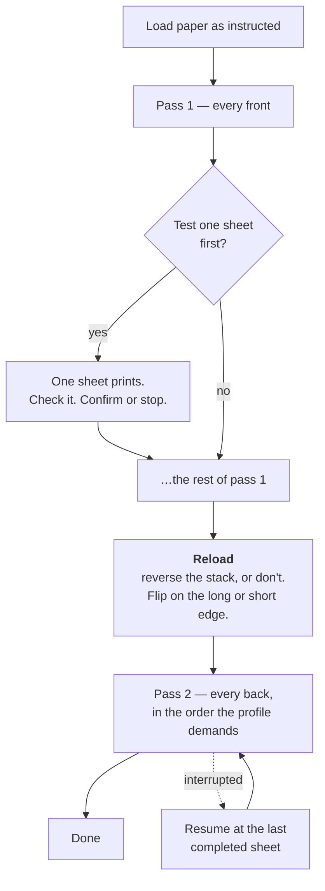

# The Deckle Guide

How to take a PDF and end up with a book you can hold.

This is the long form. For what Deckle is and why it exists, see the
[README](../README.md). For what has changed, [CHANGELOG.md](../CHANGELOG.md).
For the engineering reasoning behind almost every decision described here —
including every defect that motivated it — [docs/decisions.md](decisions.md).

**Contents**

1. [Vocabulary](#1--vocabulary)
2. [Choosing paper](#2--choosing-paper)
3. [The four margins](#3--the-four-margins)
4. [Path A — flat sheets, end to end](#4--path-a--flat-sheets-end-to-end)
5. [Path B — signatures, end to end (experimental)](#5--path-b--signatures-end-to-end-experimental)
6. [Printing manual duplex](#6--printing-manual-duplex)
7. [Reading a binding schedule](#7--reading-a-binding-schedule)
8. [CLI reference](#8--cli-reference)
9. [Troubleshooting](#9--troubleshooting)

---

## 1 · Vocabulary

Deckle uses bookbinding words throughout, in the app, in the CLI help, and in
its warnings. They are worth ten minutes.

| Word | Meaning |
|---|---|
| **Deckle** | The rough, feathered edge of a sheet of handmade paper, left by the frame it was formed in. The app is named for it. |
| **Recto** | A right-hand page. The first face of a sheet through the printer. |
| **Verso** | A left-hand page. The second face. |
| **Gutter** | The inner margin, at the spine. It has to be wider than the fore-edge, because binding swallows part of it. |
| **Fore-edge** | The outer margin — the edge you see and thumb when the book is closed. |
| **Head / tail** | Top and bottom margins. |
| **Folio** | A sheet folded once, giving four pages. Also the imposition scheme that produces them. |
| **Signature** | Several folded sheets nested inside one another and sewn as a unit. Also called a gathering or a section. |
| **Saddle stitch** | Sewing (or stapling) through the fold of a signature. |
| **Sewing station** | One hole pierced through the fold, where the needle passes. |
| **Grain** | The direction paper fibres lie. Paper folds cleanly along the grain and cracks across it. |
| **Swell** | The extra thickness sewing thread adds at the spine, which the fore-edge does not have. |
| **Creep** | Nested sheets pushing each other outward at the fore-edge, so the innermost leaf protrudes. |
| **Imposition** | Deciding which page goes where on which sheet, and which way round. |

---

## 2 · Choosing paper

### Size and orientation

Presets: `letter`, `a4`, `legal` in the CLI; Letter, A4, Legal, A3 and Tabloid
in the app. Any other size goes in as `WxH` with a unit — `--paper 500x700pt`,
`--paper 210x297mm`.

Orientation is stored as the paper tuple itself, not as a separate flag, so
nothing downstream has to know about it. Changing the size in the app
preserves your chosen orientation: picking A4 while in landscape does not
silently flip you back to portrait. A custom size is offered back to you
verbatim rather than snapped to the nearest preset, because rounding your
paper on open would be a silent data change.

**Folio needs landscape.** Two portrait book pages sit side by side on one
sheet. Ask for folio on portrait stock and Deckle proceeds, but says so:

```
[sheet_orientation] sheet 0: fold_scheme="folio" expects landscape paper
wider than it is tall; proceeding with the paper as given
```

It advises rather than rotating. Quietly rearranging someone's settings is
worse than telling them.

### Grain — read this one

Set `--grain long` or `--grain short` if you know your stock, and Deckle
checks the one rule the bookbinding literature is unanimous about: **grain
must run parallel to the spine.**

Ordinary office Letter and A4 are **long grain** — fibres along the 11-inch
dimension. Turn a sheet landscape to fold a booklet, and the fold now runs
*across* the fibres. The crease cracks and feathers instead of folding
cleanly, the finished book will not open flat, the pages cockle when glue
introduces moisture, and the spine warps with humidity. Binders buy
short-grain Letter stock specifically to avoid this.

Deckle will tell you:

```
[grain_direction] sheet 0: the fold runs across the paper grain, not along
it. long-grain stock at 792x612pt has its fibres running horizontally, while
the spine runs vertically. Expect the fold to crack rather than crease, and
the finished book to resist opening flat. Turn the sheet, or use short-grain
stock.
```

The default is `unknown`, and silent. Most people have not checked their
paper, and a warning you cannot act on is noise. If you want to check: tear a
scrap: it tears straight along the grain and ragged across it. Or bend it both
ways — it resists less along the grain.

### Thickness, and how many sheets a gathering should hold

Deckle needs one number about your paper: the caliper of a single sheet. It
affects **no placement Deckle emits** — not one. It exists so the binding
schedule can predict fore-edge creep and spine thickness, both of which you
need before the block is finished and cannot measure yet.

Three ways to give it, in the order most people can:

- **Pick the stock.** In the app, the paper dropdown on Page setup —
  `80gsm copier`, `100gsm offset`, `160gsm card` and two others.
- **Type the weight off the ream wrapper.** `--paper-weight 80gsm`, or
  `--paper-weight 24lb --paper-grade bond`. A US basis weight means nothing
  without the grade: 20lb is 75gsm as bond and 54gsm as cover, so Deckle
  refuses a pound weight without one rather than guessing wrong by half.
  `--paper-type` says how bulky the stock is, which is what separates two
  papers of the same weight; it defaults to `offset`.
- **Measure it.** `--paper-thickness 0.004in`, or `0.1mm`, or whatever your
  calipers say.

**A derived caliper is an estimate.** Bulk varies about 10% between
manufacturers, which is why the schedule reports spine width as a range rather
than a number, and why this value never moves a page.

Once Deckle knows the thickness it will suggest a gathering size: how many
sheets to nest, and **which constraint decided it**. The remedy differs —
`creep` means plan a fore-edge trim, `fold` means the paper is thick and the
gathering has to be smaller. 80gsm with a quarter-inch trim comes out at 8
sheets, a 32-page gathering, which is the standard trade signature. In the app
the suggestion appears under *Sheets per signature* with an **Apply** button,
and disappears once you have taken it.

---

## 3 · The four margins

The gutter *is* the inner margin. Those four fields describe all four edges of
the page:

```
        head
   ┌─────────────┐
   │             │
gutter        fore-edge      (recto: gutter left, fore-edge right)
   │             │           (verso: mirrored)
   └─────────────┘
        tail
```

**Margins are minimums, not exact values.** Content is always scaled to the
largest size that fits the content box in *both* dimensions. There is
deliberately no "scale mode": "fill the height, then shrink until it fits"
*is* the fit operation, and the only behaviour the second mode ever had that
the first did not was producing output too wide to print.

Because content keeps its aspect ratio, it can only touch the content box on
whichever axis binds. On the other axis there is slack — and slack has to go
somewhere.

### Which margin absorbs the slack

Vertical slack is always split between head and tail. Neither has a binding to
accommodate, so there is nothing to bias toward.

Horizontal slack is a real decision, because source pages in one document
often differ in width, and whichever margin absorbs the difference is the one
that *varies* through the book. The setting is `slack_to`:

| Setting | Gutter | Fore-edge | Use it when |
|---|---|---|---|
| `gutter` (default) | varies; a minimum | **exact, identical on every page** | Normally. The fore-edge is what you see on a closed book; gutter variation disappears into the binding. |
| `outer` | **exact, identical on every page** | varies | You have a fixed punch or a sewing template and the spine margin must not move. |
| `split` | varies | varies | You want the content visually centred, with your requested difference preserved exactly. |

Concretely, on a real 266-page book whose cover is 12.5pt narrower than its
body pages, with gutter 0.75in and fore-edge 0.25in, the measured inner
margins across pages come out `[0.93, 0.75, 0.75, 0.75]` under `gutter`,
`[0.75, 0.75, 0.75, 0.75]` under `outer`, and `[0.84, …]` under `split`.

> **Note.** `slack_to` and the three non-gutter margins are configurable in
> the desktop app and stored in the `.deckle` project file, but the CLI
> currently exposes only `--gutter`. If you need specific head, tail or
> fore-edge margins from the command line, set them in the app and save the
> project. This is a genuine gap, not an omission from this guide.

### One scale for the whole document

Every page is scaled by the same factor — the largest that fits *every* page.
Per-page scaling was the original behaviour and it looked fine until someone
set a gutter, at which point a narrower cover printed 2.5% larger than the
body. Page *geometry* is still per-page: each page's own media box determines
its size, slack and placement. Only the scale factor is shared.

### Two guides in the preview, and why

The preview draws two rectangles that are easy to confuse:

- **Solid red — the imageable area.** The border your printer physically
  cannot mark, typically 0.16–0.25 inches. Deckle cannot infer this from the
  imposition, because the imposer never sees the printer; the preview and
  "Use printer margins" both read it from the profile of the printer selected
  in the Print dialog. **Which means it is only as true as that profile.** A
  printer you have calibrated draws its measured border. One you have not
  draws the generic preset's 0.25in stand-in, which is a plausible number and
  not *your* number — Deckle does not yet ask the driver for the real
  printable rectangle. Print a proof sheet before trusting the last eighth of
  an inch.
- **Dashed blue — the content box.** Your margins. It mirrors between recto
  and verso.

They coincide only when every margin happens to equal the printer's inset.
When content is clipped, Deckle distinguishes *which* rectangle clipped it —
`clipped_by_page` means it ran off the paper, `clipped_by_imageable_area`
means it landed inside the dead border. Those are different problems with
different fixes.

---

## 4 · Path A — flat sheets, end to end

One book page per sheet face, no folding. The gutter alternates sides so every
gutter lands at the spine once the leaves are stacked. This is the proven
path: its placement output is verified identical to the previous
implementation across six setting combinations and two documents, one of them
a 300-page book with mixed page sizes.

Bind the result by guillotining and gluing, by punching and posting, or by
sewing through the side.

### Step by step

**1. Look at what you have.**

```bash
python -m deckle.cli info book.pdf
```

```
page count: 14
detected page sizes (pt):
  396.00 x 612.00
signature count: 0
sheet count: 7
blank count: 0
layout warnings: none
```

Zero signatures is correct under flat sheets — there is nothing to gather.
Mixed page sizes showing up here is worth noticing: it is what makes
`slack_to` matter.

**2. Impose and export.**

```bash
python -m deckle.cli export book.pdf -o book-deckle.pdf --gutter 0.75in
```

Warnings go to stderr, the written path to stdout, so this stays scriptable.
An exit code of 1 means nothing was written.

**3. Look at it.** Open the PDF, or better, open the source in the desktop app
and use the preview with the **Both** toggle on, which renders front and back
side by side from a single pass. Check that the gutter mirrors: left on the
recto, right on the verso. That mirror is a real bug that once shipped —
`fixed_gutter` put the reserved gutter on the wrong side of the verso, and
every test that existed asserted the gutter-left side, where the two modes
agreed.

**3b. Crop the source, if it came from a scan.** Every other setting adds
space; `--crop` is the only one that removes it.

```bash
python -m deckle.cli export scan.pdf -o out.pdf --paper 5.5x8.5in     --gutter 0.5in --crop 1.5in,1.5in,1.5in,1.5in
```

Four insets — left, bottom, right, top — from each source page's own edges.
Insets rather than a rectangle because one document can hold pages of
different sizes, and a fixed rectangle would mean something different on each.

The edges are the ones **you can see**, not the ones the file stores. A page a
scanner straightened carries a `/Rotate` flag: the content is left alone and
the page records which way up to display it, so its stored left edge may be
what you see at the top. `--crop 100pt,0,0,0` takes 100pt off the left of the
page as it appears in a viewer, at any rotation — which is also the frame
`--auto-crop` measures in and the preview renders in, so the number you read
off one is the number the other applies.

This matters more than it sounds. A public-domain PDF typeset for a different
trim size carries an inch or more of white on every edge, and scaling it into
a small cell scales the *margins* too. On a 612×792 scan with 1.5in margins
imposed into a 5.5×8.5 book, cropping takes the content scale from 0.59 to
0.91 — 11pt body text lands at 10pt instead of an unreadable 6.5pt.

Use `--crop-even` when the source is a scan whose gutter swaps sides every
leaf; one rectangle cannot fit both. Without it, `--crop` applies to the whole
document.

**Or let Deckle measure it.** `--auto-crop` rasterises the pages, finds where
the ink actually is, and reports the values it derived:

```
auto-crop: --crop 106.0pt,106.0pt,106.0pt,106.0pt
auto-crop: --crop-even 106.0pt,106.0pt,106.0pt,106.0pt
```

Those are printed as `--crop` values on purpose: measure once, then pin them
and stop rasterising the whole document on every run.

It measures odd and even pages separately, which is the case `--crop-even`
exists for. The crop is the *least aggressive* inset any page needs, not a
per-page fit — cropping each page to its own ink would let the text block
move from leaf to leaf, which is worse than not cropping.

Ink bounds come off a low-resolution raster, so the answer runs a point or two
shy of the true edge — it errs toward keeping content. Use `--auto-crop-margin
6pt` to keep more back for descenders and hairline rules.

**Check it before you commit to it.** `deckle crop-preview` superimposes every
page into one picture and draws the proposed crop on it in red:

```bash
python -m deckle.cli crop-preview scan.pdf -o overlay.png --auto-crop
```

Anything outside the red rectangle is what the crop would remove. This is what
catches the outlier — a marginal note on one page in two hundred, a figure that
runs wider than the text block — which a measurement reports as a number and a
picture shows you instantly.

Darkest pixel wins, so a mark present on a single page survives into the
composite at full strength. Averaging would fade exactly the mark you need to
see.

Add `--parity odd` or `--parity even` to look at one side of a scan whose
gutter alternates. Without it, both the picture and the rectangle cover every
page — they always describe the same set of pages, because a rectangle
measured from half of them and drawn over all of them would make a crop that
clips look safe.

The desktop app has the same numbers on its **Crop & trim** tab — eight spin
boxes, odd and even pages separately, and a **Measure crop from the ink**
button that does what `--auto-crop` does. What it does not have is an
interactive editor: there is no picture in the app to drag a rectangle on. So
this is still a composite you look at, then numbers you type — into the tab or
into a `--crop`, whichever you are already in.

**4. Proof one sheet.** Before committing a stack, print sheet 0 on its own.
Sheets are numbered from 0, the same as everywhere else Deckle counts them.

```bash
python -m deckle.cli export book.pdf -o proof.pdf --gutter 0.75in --sheets 0 --rule
```

`--sheets` takes single numbers, comma lists and inclusive ranges — `0`,
`2,0`, `0,2-4`. Asking for a sheet the document does not have is an error, not
an empty PDF.

`--rule` draws a ruler of known length across the sheet and prints what it
should measure. This is the only direct evidence that your printer honoured
actual-size printing: the exported PDF asks for it via `/PrintScaling /None`,
but that is a hint, and a driver preset can override it. A sheet scaled by
three percent looks completely correct — a seven-inch line that measures
6¾ does not. The rule is drawn *over* the content, so use it on a proof and
not on the job.

Check the same sheet for the two things that are cheap to fix now and
expensive to fix after a stack: the back is upright, and the gutter falls on
the edge you are binding.

**5. Print.** See [§6](#6--printing-manual-duplex).

**6. Bind.** Nothing to fold. Stack in order, jog the spine edge square, and
bind along the gutter side.

### If Deckle stops unexpectedly

Deckle autosaves beside the project on every edit. Reopen a project it did not
close cleanly and it asks whether to recover the unsaved changes.

Detection is by modification time, not by whether an autosave exists — a clean
quit flushes one too, so "does the file exist" would prompt on every single
open, and a prompt that always fires is one people learn to dismiss without
reading. Saving makes the project newer than its autosave, which is what keeps
it quiet.

Declining deletes the autosave. That is deliberate: leaving it would bring the
prompt back on every subsequent open of the same project.

A project that has never been saved has nowhere to autosave *to*, so this
protects a job you have named and not the one you started ten minutes ago.
Save early.

---

## 5 · Path B — signatures, end to end (experimental)

Four book pages per sheet — two per face — folded once and nested into
gatherings that get sewn through the fold.

> ### Read this before committing paper
>
> Folio is **experimental**, and the reason is specific rather than general.
>
> The geometry is verified. Two independent placements per face, no scale
> drift between them, and the fold proven to sit at the centre of the sheet on
> *both* faces — that last one matters, because a sheet whose front hinges at
> the fold and whose back hinges at the trimmed edges produces a book that
> will not open, and nothing else would complain, since the PDF is valid
> either way.
>
> What is **not** verified is the page *ordering*: which source page lands in
> which cell of which sheet so the stack reads correctly once folded. That is
> hand-written arithmetic. Every automated test proves the ordering is
> consistent and self-inverse. None proves it is *correct*, because software
> cannot tell you which way the paper folds. The only real check is folding a
> physical dummy and reading it, and nobody has done it.
>
> Two ways to close the question yourself, both cheap. Do one.

**Check 1 — fold a numbered dummy.** Five minutes, and the only one of the two
that answers the question outright.

```bash
python -m deckle.cli dummy -o dummy.pdf --pages 8
python -m deckle.cli export dummy.pdf -o dummy-folio.pdf     --fold-scheme folio --paper 11x8.5in
```

Print it on scrap, fold it in half, and read the numbers. They should run
1, 2, 3… straight through. Every page carries an underline and a `HEAD`
label, so a leaf that arrives upside down is obvious — a bare numeral cannot
tell you, since 6 and 9 are each other rotated and 8 is its own rotation.

The numbers go on a synthetic *source* which then runs through the ordinary
import-impose-export path, so what you are checking is the real pipeline and
not a parallel "test mode" that could disagree with it.

For reference, the imposed faces of an eight-page folio come out:

```
face 0:  8 | 1        ← outermost
face 1:  2 | 7
face 2:  6 | 3
face 3:  4 | 5        ← centre of the fold
```

That matches what every bookbinding manual prints. It is checked
automatically in `tests/test_dummy.py` — but only against the manual's
*arithmetic*. Software still cannot tell you which way paper folds, which is
why the scrap print is the check that closes it.

**Check 2 — read the schedule against a manual.** Thirty seconds, and it
checks the arithmetic rather than the fold.

```bash
python -m deckle.cli schedule book.pdf --fold-scheme folio --landscape
```

For a 16-page signature it prints (this is real output):

```
    sheet 0  (outermost)
        front:  16  1
        back:   2  15
    ...
    sheet 3  (position 4)
        front:  10  7
        back:   8  9
```

Every bookbinding manual has that table. If they agree, the arithmetic is
right, and it will stay right.

### Step by step

**1. Turn the paper.** Two portrait pages side by side need landscape stock.

**2. Set the grain,** if you know it. Landscape long-grain Letter is exactly
the case the warning exists for.

**3. Choose sheets per signature.** Four is the default and a sensible one:
sixteen pages per gathering, thin enough to fold cleanly and to keep creep
negligible. More sheets means fewer gatherings to sew and a worse fore-edge.

**4. Decide where the blanks go.** A page count rarely divides evenly into
signatures, so Deckle pads. `--blank-mode end` puts every padding blank in the
final signature; `balanced` spreads them so no gathering is more than one
sheet thinner than its neighbours.

**5. Impose.**

```bash
python -m deckle.cli export book.pdf -o booklet.pdf \
    --fold-scheme folio --landscape \
    --gutter 0.5in --sheets-per-signature 4 \
    --grain long --paper-thickness 0.004in \
    --sewing-stations 3
```

Expect warnings, and read them. On a 14-page document at four sheets per
signature:

```
[signature_padding] sheet 0: padded with 2 blank page(s) to complete the
  final signature
[creep_advisory] sheet 0: predicted fore-edge creep of 1.15pt over 4 sheets
  per signature; reduce to 2 sheets per signature to shrink it
```

**6. Save the schedule** and print it. See [§7](#7--reading-a-binding-schedule).

**7. Print.** See [§6](#6--printing-manual-duplex).

**8. Gather.** Take the schedule. For each signature, stack the sheets in the
order it lists — the first listed is the **outermost**, the one that wraps all
the others. Nest each subsequent sheet inside the previous.

**9. Fold** the whole gathered stack in half at once, along the printed fold
line, with a bone folder if you have one. Folding the stack together rather
than sheet by sheet is what makes the folds line up.

**10. Pierce** at the printed sewing-station marks, through the fold. With the
default three stations, the outer two sit 36pt (0.5in) from head and tail.

**11. Sew,** stack the signatures in order — the staircase signature-order bar
printed on the spine makes a miscollated stack obvious before a single stitch
goes in — and press.

**12. Trim the fore-edge** if creep was flagged, and cut boards against the
spine range the schedule gives.

---

## 6 · Printing manual duplex

Deckle splits a double-sided job into two passes and tells you what to do in
between. This is the part no comparable tool does at all.



### Sheets print at actual size

An inch of the design is an inch of paper. Deckle paints each sheet 1:1 at the
corner of the sheet and does not scale it to fit what your printer can reach.

This is the only behaviour that makes the rest of the program honest. The
binding schedule tells you to print at actual size; the exported PDF carries
`/PrintScaling /None` so a viewer will not helpfully shrink it; the proof rule
exists to be measured with a ruler; and the spine width the schedule gives you
is the number you cut boards against. A sheet quietly scaled to 94% to clear
the printer's border would make every one of those wrong by the same 6%, and
you would not find out until the case would not close on the text block.

The cost is real and deliberate: content that falls inside your printer's
non-printable border **is clipped**, because no software can print there.
Deckle tells you before the paper is spent rather than after — the preview
draws that border in solid red, and a `clipped_by_imageable_area` warning
names it specifically. If you see it, move your margins out; do not expect the
printer to shrink the book for you.

> Check it once, on your own printer: print a proof sheet with `--rule`, put a
> ruler on it, and confirm the inch is an inch. If it is not, your *printer
> driver* is scaling — look for "fit to page" or "shrink oversized pages" in
> its dialog and turn it off.

### The printer profile

A profile records four things about one physical printer: which face the sheet
lands on, which edge feeds first, whether the operator must reverse the output
stack, and which edge the operator flips on. From those, two decisions follow
automatically:

| Profile says | Effect on pass 2 |
|---|---|
| `reverse_stack: true` | Sheets are fed in **reverse** order |
| `reverse_stack: false` | Sheets are fed in the **same** order |
| `flip_axis: long` | Back faces are **rotated 180°** |
| `flip_axis: short` | No rotation |

Deckle turns that into a sentence before you touch the stack — for example:
*"After pass 1 finishes, reverse the printed stack (flip the whole stack over)
before reloading, flip each sheet on its long edge, face down, and print pass
2 (backs)."*

**The calibration wizard is not built.** Until it is, Deckle uses two built-in
generic presets covering the two common reload behaviours: a face-down printer
whose stack comes out reversed, and a face-up printer that keeps its order.

Both are reachable. The Print dialog's **Paper** picker lists them by what
they mean at the tray — "Comes out face up, order kept" — rather than by name,
because those two axes are the whole of what decides the reload instruction.
The choice is remembered under the printer's name, and re-offered per printer,
since a saved calibration belongs to one machine. On the command line they are
`--profile generic_face_down_reversed` and
`--profile generic_face_up_in_order`.

A profile you have measured and written by hand outranks both: it sorts first
in the picker and is preselected, and Deckle will not overwrite it with a
preset. Profiles are persisted per printer name as JSON under the OS config
directory (`%APPDATA%\Deckle\printer_profiles` on Windows), so a hand-edited
one survives.

### Test one sheet first

Tick it. It prints a single sheet, stops, and waits for you to confirm. A
minute spent here is the difference between discovering a bad profile on one
sheet and discovering it on sixty.

### Resume, and when Deckle refuses

Print runs are backed by a disk session, so an interrupted job — a crash, a
paper jam, a printer that vanishes — resumes at the last completed **sheet**,
not from the beginning.

Resume **refuses** if the document changed since the session was saved. It
compares a fingerprint of the plan and raises rather than continuing. This is
deliberate and the asymmetry is the reason: by the time you resume, you have
already physically reloaded the stack, so continuing against a re-imposed
document prints backs onto the wrong fronts and the first symptom is a ruined
pile of expensive paper. Refusing costs you a reprint you were about to do
anyway.

There are two distinct refusals, and they say different things — the document
changed, versus Deckle's own session format changed. They need different
answers, and conflating them would send you hunting for an edit you never
made.

### Front/back registration — making the back land behind the front

Consumer printers do not put the second side exactly behind the first, and a
manual-duplex reload is worse than a real duplexer because you re-register the
stack by hand against the paper guides. Fold a folio sheet and the error
doubles and becomes visible: the spine margin differs between recto and verso,
and trimming the fore-edge leaves the text block off-centre on every other
page. On a gutter-shift job one side of every leaf gets a narrower gutter, and
a 3-hole punch eats into text on the tighter side.

Deckle corrects it with two numbers per printer:

```bash
python -m deckle.cli export book.pdf -o out.pdf --back-offset 3,-2
# registration: back faces moved +3, -2pt (--back-offset).
```

`X,Y` are in points unless you give a unit (`0.5mm,-1mm`, `-0.25in,0`), and
they are the **correction** — how far the back-side content moves, `+x` right
and `+y` up. Fronts are never touched: the front is the reference the back is
being aligned to.

Store them on the profile once you know them, as `back_offset_x_pt` and
`back_offset_y_pt` in the printer's JSON file, and every `--pass back` and
every desktop print run applies them without the flag. `--back-offset`
overrides the stored value, which is what makes trial-and-error bearable.

**Finding your two numbers.** The calibration wizard is not built, so this is
currently iterative:

1. Print one sheet, both sides, with a ruler on each face:
   `--sheets 0 --rule`, once with `--pass front` and once with `--pass back`.
2. Hold the sheet to a bright light. The two rules should sit exactly on top
   of one another. Note which way the back is off, and by how much.
3. Try that as `--back-offset`, reprint, and look again. If it got worse,
   flip the sign — the through-the-paper view mirrors one axis, and one
   reprint settles the direction faster than reasoning about it does.
4. Two or three rounds is normal. Write the result into the profile.

> **It corrects a constant offset.** It cannot correct rotational skew or a
> scale error. If the two rules are not parallel, or differ in length, that is
> a different problem and this will not fix it.

### Manual duplex from the CLI

The desktop app drives the printer directly. The CLI writes each pass as its
own PDF, for printing from a viewer, a print server, or a machine with no
display at all:

```bash
python -m deckle.cli export book.pdf -o fronts.pdf --gutter 0.75in \
    --pass front --profile generic_face_down_reversed
# wrote fronts.pdf
# Load paper face down, feed edge top, and print pass 1 (fronts).

python -m deckle.cli export book.pdf -o backs.pdf --gutter 0.75in \
    --pass back --profile generic_face_down_reversed
# wrote backs.pdf
# After pass 1 finishes, reverse the printed stack (flip the whole stack
# over) before reloading, flip each sheet on its long edge, face down, and
# print pass 2 (backs).
```

`--profile` takes a calibrated profile saved under a printer's name, or one of
the built-in presets above. `--pass` requires it: neither the sheet order nor
the half turn has a safe default, and guessing wrong prints every back onto
the wrong front — which you discover only once the paper is spent.

Both the sheet order and the rotation come from the same `plan_passes` the
desktop app uses. The CLI decides neither; a second implementation of the
ordering table would be free to disagree with the app about the same printer,
and the paper would be wrong while both halves looked right.

Add `--sheets` to narrow a pass — `--pass back --sheets 7` reprints one sheet's
back without re-running the job.

> **A pass PDF asks the driver *not* to duplex.** It carries one face per page,
> so a printer that duplexed it would put two consecutive fronts on two sides
> of one sheet. Deckle writes `/Duplex /Simplex` on a pass and the real flip
> edge only on a both-faces export, which is the document a real duplexer
> actually wants.

---

## 7 · Reading a binding schedule

```bash
python -m deckle.cli schedule book.pdf --fold-scheme folio --landscape \
    --paper-thickness 0.004in -o schedule.txt
```

Without `-o` it goes to stdout, so it pipes and redirects. Warnings still go
to stderr, which keeps a redirected schedule clean while leaving the warnings
visible in your terminal.

Print it. Hands covered in PVA do not scroll.

Real output, annotated:

```
BINDING SCHEDULE -- sample.pdf
==============================

1 signature(s) - 4 sheet(s) of paper - 2 blank page(s)      ← the whole job

Print all fronts, reload the stack, then print all backs.
Keep the sheets in the order they emerge.                   ← this matters

SIGNATURE 1  (pages 1-14)
-------------------------
  4 sheet(s), 16 pages, 2 blank        ← 16 pages for 14 of content; 2 padded

  Gather in this order -- first listed is the OUTSIDE of the fold:
    sheet 0  (outermost)               ← stack this one first, at the bottom
        front:  blank  1               ← left cell, right cell
        back:   2  blank
    sheet 1  (position 2)              ← nest inside sheet 0
        front:  14  3
        back:   4  13
    sheet 2  (position 3)
        front:  12  5
        back:   6  11
    sheet 3  (position 4)              ← innermost; the centre spread
        front:  10  7
        back:   8  9

  Fold the gathered stack in half along the printed fold line.
  Pierce 3 sewing station(s) on the fold, at the printed marks.
  The first and last sit 36pt (0.50in) from head and tail.

AFTER SEWING
------------
  Stack the signatures in order, 1 first.

  Spine thickness: about 0.02-0.02in (1-1pt).
    4 sheets at 0.288pt, plus 10-25% swell from the sewing thread.
    Cut boards and spine against this, then measure the real block before
    covering.
```

Two things to understand about it.

**Page numbers are what a reader sees**, one-based, left to right as the sheet
lies in front of you. `blank` is a padding page with no content.

**The spine figure is a range on purpose.** Caliper moves a few percent with
humidity, and swell depends on thread weight, sewing style, and how hard the
block is pressed. The schedule prints its own assumption so you can judge it.
Cut boards against the range, then measure the real block before covering — a
single confident number here would be false precision about the one dimension
you will remeasure anyway.

**And the schedule never recomputes the imposition.** Every number in it is
read from the same plan the exporter used. A schedule that derived its own
sheet order would be a second implementation of the imposition, free to
disagree with the PDF in your hands — and the paper would be wrong while both
halves looked internally consistent.

Under flat sheets there is nothing to gather, so the schedule says so and
gives you the sheet count. That is more honest than inventing instructions for
work nobody is doing.

---

## 8 · CLI reference

```
python -m deckle.cli <command> [options]
```

Or, packaged, `deckle-cli`. On Windows, `.\run.bat cli <args...>` passes
through to the same thing.

The CLI imports only `deckle.core`, never Qt, so it runs headless — on a
server with no display libraries installed at all.

### Global

| | |
|---|---|
| `--version` | Deckle's version plus the resolved versions of `pikepdf`, `pypdfium2`, `img2pdf` and `PySide6`. The first thing anyone asks for in a bug report. Works without a subcommand. |
| `-h`, `--help` | Usage. Also available per subcommand. |

### Commands

| Command | What it does |
|---|---|
| `info SOURCE` | Page count, detected page sizes, signature/sheet/blank counts, and every layout warning. Changes nothing. |
| `export SOURCE -o OUT.pdf` | Impose and write the imposed PDF. |
| `impose SOURCE -o OUT.deckle` | Impose and write a `.deckle` project file, to open in the app. Also takes `--printer NAME` to record a printer with it. |
| `schedule SOURCE [-o OUT.txt]` | Print the binding schedule. Defaults to stdout. |
| `crop-preview SOURCE -o OUT.png` | Write a composite of every page with a proposed crop drawn on it, to look at before you commit to the numbers. `--parity odd`/`--parity even` for a scan whose gutter alternates; `--dpi` sets the rasterisation resolution (default `72`). |
| `dummy -o OUT.pdf` | Write a numbered document whose only content is its own page order, for checking how an imposition folds on scrap. `--pages N` (default `16`) — here a *count*, not the page selection the layout options below describe, because `dummy` has no source to select from — and `--page-size WxH` (default `letter`). Takes no `SOURCE`. |

`-o`, or `--output`, is the destination in every command that writes one.
`schedule` is the only one where it is optional; without it the schedule goes
to stdout.

`SOURCE` is a PDF file, **a directory of images**, or **a `.deckle` project
you saved earlier**. Image folders are ordered naturally by filename (`page2`
before `page10`), EXIF orientation is honoured, DPI is inferred, and images
are embedded losslessly.

A `.deckle` carries its own layout, and **that layout wins**: it is the one
you set up, previewed and saved, and silently overriding it from flag defaults
would make `deckle export project.deckle` produce a different book from the
one the project describes. Layout flags typed beside a project are reported as
ignored on stderr rather than quietly dropped — and rather than applied, which
would be worse. `--sheets`, `--pass`, `--profile` and `--printer` are not
layout, and are honoured. (`dummy` is the exception to all of this: it has no
`SOURCE`.)

### Layout options

Every command above accepts all of these — so a plan you inspect with `info`
is the plan `export` writes.

| Option | Default | Notes |
|---|---|---|
| `--gutter LENGTH` | `0` | The spine margin. |
| `--paper PAPER` | `letter` | `letter`, `a4`, `legal`, or `WxH[unit]` such as `500x700pt`. |
| `--landscape` | off | Turns the sheet on its side. Folio wants this. Applied to whatever you asked for, so `--paper 792x612pt --landscape` stays landscape rather than flipping back. |
| `--binding-edge {left,right}` | `left` | Which edge the gutter shifts toward. Under folio this means reading direction. |
| `--fold-scheme {none,folio}` | `none` | `none` is flat sheets; `folio` is saddle-stitch signatures (experimental). |
| `--sheets-per-signature N` | `4` | Folio only. |
| `--blank-mode {end,balanced}` | `end` | Folio only. Where padding blanks land. |
| `--grain {long,short,unknown}` | `unknown` | Fibre direction. `unknown` is silent. |
| `--paper-thickness LENGTH` | `0` | Caliper of one sheet. Affects advisories only — never a placement. |
| `--paper-weight WEIGHT` | unset | What the ream wrapper says — `80gsm`, or `24lb` with `--paper-grade`. An alternative to `--paper-thickness` for anyone without calipers; giving both is refused rather than resolved. |
| `--paper-type {bulky,coated,copier,laser,offset}` | `offset` | How bulky the stock is, which is what separates two papers of the same weight. |
| `--paper-grade {bond,cover,index,tag,text}` | unset | Which basis size a pound weight is quoted against. Required with a `lb` `--paper-weight`: 20lb is 75gsm as bond and 54gsm as cover. |
| `--signatures N,N,N` | unset | Each gathering's sheet count — `10,10,8` — instead of one uniform `--sheets-per-signature`. Must add up to the document's sheet count. |
| `--crop L,B,R,T` | none | Remove space from every source page before imposing: insets from left, bottom, right and top. |
| `--crop-even L,B,R,T` | none | A different crop for even-numbered pages, for a scan whose gutter swaps sides every leaf. Without it, `--crop` applies to the whole document. |
| `--auto-crop` | off | Measure the crop from where the ink actually is. Odd and even pages are measured separately, and the values found are printed so you can pin them with `--crop`. |
| `--auto-crop-margin LENGTH` | `0` | Keep this much back from every edge `--auto-crop` found, for descenders and hairline rules a low-dpi scan can miss. |
| `--trim LENGTH` | `0` | Draw cut lines this far in from head, tail and fore-edge, where the block is trimmed square after sewing. The spine is never cut. |
| `--sewing-stations N` | `3` | Folio only. `0` disables the marks. |
| `--pages SPEC` | every page | Use only these pages of the source, counting from **1** as your PDF viewer does — `7-312`, `1,3`, `7-312,400`. A public-domain scan carries a scanner target, a bookplate and a colophon, and none of them belong in the book. The pages you leave out are marked *skipped*, not deleted: a `.deckle` written this way keeps the whole source and the decision, so reopening it shows what was excluded rather than a document that mysteriously starts at page 7. Applied before `--auto-crop`, so a scanner target's calibration bar cannot widen the measured ink extent of the book. Ignored for a `.deckle` source, which carries its own. |

**Lengths** accept `in`, `pt`, `mm` or `cm`, with or without a space:
`0.75in`, `18pt`, `5 mm`. A bare number means points.

### `export` only

| Option | Default | Notes |
|---|---|---|
| `--sheets SPEC` | every sheet | Export only these, counting from 0 — `0`, `2,0`, `0,2-4`. Print sheet 0 on its own to proof a job before committing the stack. |
| `--rule` | off | Draw a ruler of known length on every sheet, to check whether the printer scaled the page. Use it on a proof, not on the job. |
| `--pass {front,back}` | both faces | Write one manual-duplex pass instead of both: every front, or every back in the order your printer's reload behaviour demands. Requires `--profile`. |
| `--profile NAME` | none | The printer profile describing your reload behaviour: one saved under the printer's name, or a built-in — `generic_face_down_reversed` or `generic_face_up_in_order`. |
| `--back-offset X,Y` | the profile's | Move back faces by X,Y so they land behind their fronts — `3,-2`, or `0.5mm,-1mm`. Overrides the value stored in the profile. Corrects a constant offset only, not skew or scale. |

`impose` additionally takes `--printer NAME`, to record a printer with the
project.

**Not available from the CLI:** head, tail and fore-edge margins; `slack_to`;
`start_on_recto`; landscape policy. Those are app-and-project-file settings
today.

### Exit codes and streams

- `0` on success, `1` for a source that could not be loaded or a destination
  that could not be written.
- Errors go to **stderr**. On failure, **stdout stays empty**, so the CLI
  remains scriptable.
- Layout warnings go to stderr and **never** change the exit code. A warning
  is advice, not a failure.
- Verify exit codes outside a pipeline. `cmd | tail -2; echo $?` reports
  `tail`'s status, not the command's — a mistake made twice during Deckle's
  own development.

### `run.bat` — the Windows dev launcher

| | |
|---|---|
| `run.bat` | Launch the GUI |
| `run.bat cli <args...>` | Headless CLI, arguments passed through |
| `run.bat test [args]` | pytest, arguments passed through |
| `run.bat deps` | Install or refresh dependencies |
| `run.bat doctor` | Interpreter, dependency versions, and printers Qt can see |
| `run.bat docs` | Build the Sphinx API reference |
| `run.bat package` | Build `deckle.exe` and `deckle-cli.exe` into `dist\deckle` |

From a terminal, invoke it as `.\run.bat` — cmd does not search the current
directory. Double-clicking from Explorer works as-is.

`run.bat package` takes about two minutes and goes quiet while PyInstaller
processes the PySide6 hooks. It builds from a clean `.buildenv` virtualenv,
not from your interpreter, and gates on an audit of the produced artifact.

---

## 9 · Troubleshooting

Every case below is a real failure that happened during development and was
fixed by making the message better. They are recorded in full, with the
reasoning, in [docs/decisions.md](decisions.md).

<details open>
<summary><b>"cannot write to Q:\out.pdf: the drive Q: does not exist or is not connected"</b></summary>

Exactly what it says — a drive letter that is not mounted, usually a network
share that has dropped or a USB stick that is not in. Check the letter, or
choose a folder on a drive that is available.

Deckle checks the destination *before* doing any imposition work, so a
mistyped path costs no time and the message names the path you typed rather
than the temp file the exporter was about to rename into place.

</details>

<details>
<summary><b>"permission denied — is the file already open in a PDF viewer?"</b></summary>

Nearly always exactly that: the previous export is still open in Acrobat,
Edge, or a preview pane, which holds the file and makes the exporter's final
rename fail. Close it, or export under a different name.

The message asks rather than asserts, because guessing is worth it when the
guess is nearly always right and is trivial for you to check.

</details>

<details>
<summary><b>"cannot write to …: that is the file being imposed"</b></summary>

You pointed `-o` at the source PDF. Exporting onto the source would destroy
the original, so Deckle refuses.

The check uses `os.path.samefile`, which sees through symlinks, junctions and
`..` segments — string comparison does not. This one is in the guide because
the *earlier* version of it refused correctly and then blamed a PDF viewer
that was never involved, sending users to close applications that had nothing
to do with it.

</details>

<details>
<summary><b>"cannot write to …: that is an existing folder, not a file"</b> / <b>"the folder … does not exist"</b> / <b>"the file is read-only"</b></summary>

Give a file name, create the folder first, or clear the read-only flag. Each
message names the path and the remedy.

</details>

<details>
<summary><b>"this file is not a PDF — it does not begin with a %PDF header, despite its name"</b></summary>

The file has a `.pdf` extension and is not a PDF. Overwhelmingly this is an
error page or a partial download saved under a PDF name. Open it in a text
editor and see what it really is.

</details>

<details>
<summary><b><code>[sheet_orientation]</code> — folio on portrait paper</b></summary>

```
fold_scheme="folio" expects landscape paper wider than it is tall;
proceeding with the paper as given
```

Two portrait book pages have to sit side by side on one sheet. On portrait
stock they get squeezed. Add `--landscape`, or pick Landscape in the app's
Page setup.

Deckle proceeds rather than refusing, and does **not** silently rotate your
paper — advise, do not rearrange. Note that this warning was invisible for a
while: only `deckle info` printed layout warnings, so `export --fold-scheme
folio` onto portrait paper squeezed every sheet and said nothing at all.
`export` and `impose` print them now.

</details>

<details>
<summary><b><code>[grain_direction]</code> — the fold runs across the grain</b></summary>

Your stock's fibres run the wrong way for this fold. Three options, in order
of how much you care:

1. Ignore it. The book will work; it will not open as flat and the fold may
   feather.
2. Turn the sheet, if the imposition allows.
3. Buy short-grain stock. This is what binders actually do, and it is why
   short-grain Letter is sold at all.

If you have not measured your paper, set `--grain unknown` (the default) and
the warning goes away — not because the problem does, but because a warning
you cannot act on is noise.

</details>

<details>
<summary><b><code>[signature_padding]</code> — "padded with N blank page(s)"</b></summary>

Normal. A folio signature holds `sheets × 4` pages, and page counts rarely
divide evenly. `--blank-mode balanced` spreads the padding across signatures
instead of piling it into the last one.

</details>

<details>
<summary><b><code>[creep_advisory]</code> — fore-edge creep</b></summary>

Nested sheets push each other outward at the fold, so the innermost leaf
protrudes by roughly `(sheets − 1) × caliper`. Under about a point it is
invisible and Deckle stays quiet. Past that: trim the fore-edge after sewing,
or use fewer sheets per signature.

Deckle deliberately does **not** compensate for creep by shifting or scaling
content. At four to six sheets on office paper it is well under a millimetre,
and compensating by scaling would reintroduce exactly the type-size drift that
one document-wide scale exists to prevent.

</details>

<details>
<summary><b><code>clipped_by_page</code> vs <code>clipped_by_imageable_area</code></b></summary>

Different problems.

`clipped_by_page` — content runs off the paper entirely. Reduce the gutter or
the margins, or use larger paper.

`clipped_by_imageable_area` — content is on the paper but inside the border
your printer physically cannot mark. Increase your head/tail/fore-edge
margins, or press **Use printer margins** in the app to adopt the printer's
own inset as a floor.

The classic case: content scaled to full page height has *zero* head and tail
margin, so it necessarily lands in the dead border. All four margins default
to `0.0`, which reproduces edge-to-edge behaviour and is rarely what you want
on a real printer.

</details>

<details>
<summary><b>The Signatures settings do nothing</b></summary>

You are on the **Flat sheets** tab. In the desktop app the tabs *are* the
mode — selecting a tab sets the fold scheme. There is no separate dropdown,
deliberately: two controls for one decision meant the tab could look active
while the dropdown disagreed.

Note that gutter, margins, slack, binding edge, paper and grain sit **above**
the tabs, because both ways of making a book need them. A folded signature has
a gutter exactly as a flat page does.

</details>

<details>
<summary><b>Print is greyed out, or the app says "Checking for printers…"</b></summary>

Printer enumeration runs in the background with a five-second deadline, after
which Deckle proceeds as though no printers were found. Print enables when the
query returns.

This exists because `QPrinterInfo.availablePrinters()` enumerates *network*
printers, and the Windows spooler blocks per printer until it times out when
one is unreachable — so Deckle used to hang on launch whenever a networked
printer was offline. If you are permanently stuck at "Checking", suspect an
unreachable network printer. `run.bat doctor` lists what Qt can actually see.

Save PDF works with no printer at all, and always has.

</details>

<details>
<summary><b>Resume refuses: "the document changed"</b></summary>

Correct behaviour, and the alternative is worse. You have already physically
reloaded the paper stack; continuing against a re-imposed document would print
backs onto the wrong fronts, and you would find out when the pile was ruined.
Start a new run.

If instead it says the session *format* changed, that is Deckle's own version,
not an edit you made — start a new run and do not go looking for a change you
did not make.

</details>

<details>
<summary><b>The preview shows pages that are not in my document</b></summary>

This should not happen. Preview renders through the same bounded cache the
exporter uses, and a cache-key defect once let two different plans hash
identically and hand back the wrong PDF. It is fixed — every variable-length
component of the key is length-prefixed now — but if you ever see it, that is
a real bug and worth an issue with `deckle --version` output attached.

</details>

<details>
<summary><b>Accented or non-Latin characters in a filename</b></summary>

They work. The file keeps its real name; only the *display* of the path in a
Windows console degrades to `?` where the legacy code page cannot encode a
character.

Worth knowing because the earlier behaviour was the worst possible shape of
failure: the export succeeded, then crashed with a traceback and a non-zero
exit while printing the name of the file it had just written correctly.

</details>

<details>
<summary><b><code>run.bat</code> is not recognised</b></summary>

From a terminal, use `.\run.bat`. cmd does not search the current directory.
Double-clicking from Explorer works as-is.

</details>

<details>
<summary><b>Something degraded silently and I want to know why</b></summary>

Deckle writes a rotating JSON Lines diagnostic log under the OS data
directory. Every path that degrades instead of failing records the reason
there — an empty printer list, a session file that could not be read, a
warning that was emitted. Start there before filing an issue, and attach
`deckle --version`.

</details>

---

## Where to go next

- [README](../README.md) — what Deckle is, what it does, project status
- [CHANGELOG.md](../CHANGELOG.md) — what has been added and fixed
- [docs/decisions.md](decisions.md) — the decision log: every defect, what it
  generalises to, and what to watch for
- [docs/research/2026-08-05-competitive-gaps.md](research/2026-08-05-competitive-gaps.md)
  — what other tools do that Deckle does not, ranked, with the evidence marked
- `run.bat docs` — the generated API reference
